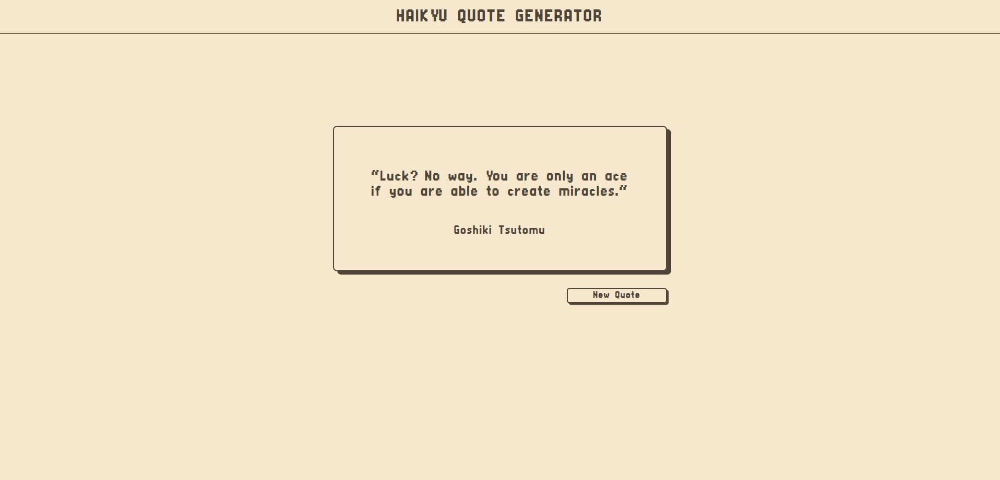

# Haikyū Quote Generator

Haikyū is an anime I love & respect the most in my life. It has taught me a lot about dedication, loyalty, passion, etc. so, I have built a Quote Generator which fetches the quote from an API (in app.js) everytime the 'New Quote' button is pressed.

### Design

- Style: Retro
- Application: Figma



### Code & URL

- [Haikyu Quote Generator](https://aditi002-holo.github.io/haikyu-quote-generator/)
- [Repository Link](https://github.com/Aditi002-holo/haikyuu-quote-generator)
- [Quotes API](https://aditi002-holo.github.io/my-apis/haikyuuQuotes.json)

### What did I learm?

- Design the page from scratch in Figma
- Create Backend API with Node JS (Express JS)
- Fetch the data with a promise
- Add Backup fonts

### Code I cherish 

```js
let url = "https://aditi002-holo.github.io/my-apis/haikyuuQuotes.json";
    fetch(url)
        .then(response => {
            if(response.ok) {
                response.json().then(data => {
                    let QuoteData = randomQuote(data);

                    quoteEle.innerText = `"` + QuoteData.quote + `"`;
                    authorEle.innerText = QuoteData.author;
                })
            }
        })
        .catch(err => {
            quoteEle.innerText = `Please Try Again`;
            authorEle.innerText = " ";
        })
```